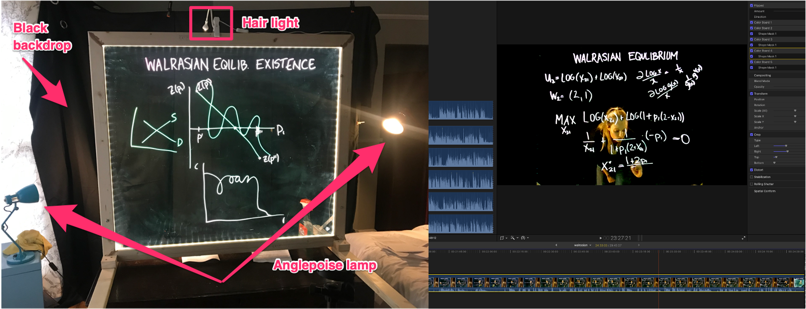

# Case study

Due to COVID-19, a significant portion of instruction in higher education has moved away from the traditional front-of-class lecture model to an active learning environment where instructors pre-record lectures and make other learning materials available in advance of a classroom experience that is instead devoted to engaging with students using active learning exercises. Many instructors are therefore required to invest a substantial amount of time into: (a) breaking their face-to-face lectures up into smaller units; (b) re-writing lecture notes so that content is clearer and better organised and students are able to easily understand and connect the videos, notes and required readings corresponding to them;^[This sort of tacit information is generally conveyed well in face-to-face settings such as at the beginning of a lecture. It is more difficult to communicate in online materials, given students may not watch and absorb them from start-to-finish.] and (c) recording a large number of lectures.

In the following section, I describe a small-scale case study that will be particularly useful for contending with points (b) and (c). In the first half of the 2020--2021 academic year, I built and incorporated a lightboard (along with an at-home recording studio) into my flipped learning environment for ECON342, an advanced undergraduate economics course I teach at the University of Liverpool. I found the lightboard enabled me to re-create my traditional "talk-and-chalk" lecture plan at home, and thus reduced the need to restructure and reorganise lecture materials to contend with the new active learning environment.^[During class, I prove all theorems and work out most examples by hand. Evaluations over several years suggest students especially appreciate this particular aspect of my course.] I also found it to be an effective way to create a large number of pre-recorded instructional videos in a relatively short amount of time. I hope that by describing the results in a case study, my own experience can be useful for other instructors wanting to better engage their students while also dealing with the constraints imposed by the COVID-19 pandemic.

## Context

ECON342 is an advanced undergraduate microeconomic theory course at the University of Liverpool. It is a required course in the Economics BSc and is usually taken during the first semester of the final year of students' undergraduate studies.

ECON342 consists of three maths-intensive modules. In the first module, students are presented with two competing yet conceptually very similar methods of economic organisation: the so-called "jungle economy" and the more familiar "market economy". The second module is devoted entirely to a fuller appreciation of market exchange. In the third and final module, the course investigates equilibrium with asymmetric information. Topics include adverse selection, moral hazard and an introduction to agency theory.

Instructor-facilitated problem solving performed during class is thought to be the most effective way to learn the material in maths-intensive economics courses. Unfortunately, it is performed at the expense of content coverage. Traditionally, ECON342 has put greater weight on the latter component relative to the former. Given the COVID-19 situation, however, the class was "flipped" in the first term of the 2020–21 academic year. In addition to enabling the course to meet stay-at-home requirements during the pandemic, "flipping" the classroom in this manner meant students could explore the lecture materials at their own pace, thus freeing up face-to-face seminar sessions to reinforce learning through guided problem-solving activities. The end result, it was hoped, would increase the amount of time students could devote to the more effective instructor-led problem-solving component of the course without forcing the instructor to sacrifice content coverage.

An additional advantage of the flipped classroom environment is that it is thought to develop students' critical thinking skills as economists---and therefore prepare future economists to be productive members of their future profession [@Shulman2005].^[Shulman calls these discipline-specific teaching practices *signature pedagogies* and defines them as "the types of teaching that organise the fundamental ways in which future practitioners are educated for their new profession" [@Shulman2005, p. 52].] This is a key objective of ECON342 as well as the University of Liverpool's aim to enhance "research-connected teaching" as part of its Curriculum 2021 framework [@Curriculum2021].

When economists reason, they often do so by analogy in the form of economic models. Economic models are powerful tools from which to draw conclusions based on the similarities between the models and real life. But they are expected to apply *only* when differences between real life and the assumptions of the model do not matter to the conclusions that are drawn. This is a subtle and difficult concept to appreciate. In order to convey it, it requires: (i) a lot of introspective effort on the part of students to understand and learn the basic building blocks of specific models; (ii) plenty of opportunities to clarify those mechanics and discuss interpretations one-on-one with class instructors; and (iii) space to collaborate with others on problem-solving. It was hoped that a flipped classroom environment involving lightboard videos would expand the scope to expose students to all three factors, and the first two, in particular.

## Building the lightboard and constructing a recording studio

The cheapest lightboard that can be purchased "off-the-shelf" costs upwards of £1,000. I therefore decided to build my own. To assemble my lightboard, I followed closely instructions from Steve Griffiths: https://flippedlearning.org/how_to/how-to-make-a-lightboard-for-less-than-100. But the concept isn't difficult: simply wrap LED lights around a large sheet of glass and then frame the edges in wood. (See the left-hand figure in Figure \@ref(fig:lightboard) for the final product.) Other designs that use plexiglass and wood clamps are even simpler to build. (See for example this video by Elisa Valkyria: https://youtu.be/L1au1JxMSaA.)

(ref:lightboard-caption) An "at-home" lightboard studio and post-producing a video

```{r ballots, fig.cap="(ref:lightboard-caption)", results='asis', fig.align="center", fig.width=1, fig.manualwidth=TRUE, fig.note="(ref:lightboard-note)", label="lightboard"}
if (doctype=="html")  else 
```

(ref:lightboard-note) Photo on the left depicts an at-home lightboard studio, including lightboard, black backdrop, anglepoise lamps on either side of the lightboard and a "hair light" attached to the top. Photo on the right is a screenshot of the author using Apple's video editing software Final Cut Pro to make post-production video edits to a lightboard video.

Filming lightboard videos additionally requires setting up a dark room in which to record the videos. The basic components of the recording studio are: (i) a black backdrop; (ii) two lamps that frame both sides of the lightboard and illuminate the "talent" (*i.e.*, the instructor); (iii) a "hair light" clamped to the top of the lightboard that lights up the instructor's face; (iv) a tripod; (v) a DSLR camera; (vi) a microphone; and (vii) Expo Neon Dry Erase Markers.

For the lighting elements, I used lamps I already owned in order to keep costs as low as possible. (All other materials were purchased on Amazon or Argos.) The hair light is a simple book light. The two lights flanking the lightboard are anglepoise lamps. Anglepoise lamps are adjustable and cover their bulbs with a solid, narrow cone that generates a focused beam of light. As a result, they are less likely to bleed light onto the black backdrop, meaning it shows up as black as possible in the videos.

In addition to lighting, the camera used to record the videos is also important. There will always be small scratches and smudges on the lightboard glass. Without proper camera settings, these imperfections will show up in the videos. Luckily, they are easy to remove: simply adjust the camera's aperture setting above 5.0 and its shutter speed at around 500. Because both setting do not come standard on most smart phone cameras, you may need to invest in a basic DSLR or bridge camera. In my own case, I purchased the cheapest camera I could find with both settings---Kodak PixPro---and have been satisfied with its results.

The final component of the recording studio is a microphone. I purchased a very cheap lapel microphone on Amazon. To record sound, I use the voice recorder that came pre-installed on my iPhone and then merge the recorded sound with the video post-production. Another option is to purchase a relatively inexpensive boom microphone and plug it directly into the audio jack on the recording camera. (Positioning the boom microphone may, however, require a second tripod.)

Filming during they day will require covering all exposed windows with black-out curtains and/or dark paper in order to limit outside light bleeding onto the black backdrop and highlighting scratches and smudges on the lightboard glass. Alternatively, simply film at night or early in the morning before the sun rises, as I did.^[I filmed most of my lightboard videos between October and December in Liverpool, where the sun rises around 08:00 and sets as early as 16:00. Instructors filming during the summer or in locations closer to the equator may find this suggestion impractical.] By negating the need to cover up windows, filming while it's dark outside also makes your recording studio easier to take down and re-assemble, which may be especially useful if you lack a spare room that can be completely dedicated to filming lightboard videos.

## Post-production {#post-production}

Post-producing lightboard videos is remarkably easy. The first decision involves software. I used the (free) 90-day trial version of Apple's Final Cut Pro and purchased the full version when the trial expired. The right-hand photo in Figure \@ref(fig:lightboard) displays a screenshot of me editing a lightboard video.^[The software details described in this article are specific to Final Cut Pro, but similar video editing capabilities are available in Camtasia Studio and Adobe Premiere Pro.]

The only post-production step that is actually necessary is to flip the video horizontally so that the instructor's handwriting doesn't appear backwards to the viewing audience. (And if you filmed your lightboard videos in a mirror, then no post-production is needed at all!) But although no more post-production video editing is technically required, several very simple edits can substantially improve the quality of your lightboard videos.

- **Merge sound and video**. Any separately recorded sound files will need to be merged with the video file. Assuming the video file has also captured sound, then this can be easily achieved using, *e.g.*, Final Cut Pro's "Synchronize clips" functionality, which automatically analyses and syncs audio and video clips that were all recorded during the same take.

- **Apply a sound compressor**. Most video editing software has a function that emulates the sound and response of a professional-level analogue compressor---*e.g.*, the "the compressor effect" in Final Cut Pro. Applying custom or preset settings (for example, the "Vocal Compressor 01" in Final Cut Pro) will greatly enhance your audio by reducing background noise, increasing the volume of your voice and bringing it into focus.

- **Adjust the exposure**. By adjusting exposure, one can almost (or even completely) eliminate larger scratches and smudges on the glass and reduce glare from too much background light. I suggest first adjusting the overall exposure to eliminate minor imperfections and then using shape masks to target any remaining scratches and smudges that are still noticeable in the videos.

- **Add an intro**. Adding an introduction with music and graphics is very easy to do with most video editing software—indeed, software like Adobe Premier Pro and Final Cut Pro come with a large number of introduction template generators pre-installed. Combine these with short, fun music clips to create an attractive introduction to your videos that will impress your students!

- **"Fast-forward" slow parts**. If you have to wipe the board, write out a long equation or draw a particularly detailed diagram while in the middle of filming, I suggest speeding that portion of the video up to 8x or 20x speed in post-production. Students appreciate not having to wait in real time for these tasks to be finished and I've found speeding them up is both less jarring and actually requires less video editing effort than cutting them out of the video entirely.

- **Reduce the file size**. Final Cut Pro produces gigantic video files. Reduce them to manageable sizes using freely available software such as the open source video transcoder HandBrake (https://handbrake.fr).

## Final results and costs

In total, I made 47 videos for ECON342, almost `r round(100*41/47, digits=-1)` percent of which used the lightboard. Average video length was 17 minutes 37 seconds; total video time was 13 hours 30 minutes and 13 seconds. A sample lecture is available on Youtube: https://youtu.be/JFXhyRIJw24. To view all of the videos, please self-enrol in ECON342 using the following web address: https://liverpool.instructure.com/enroll/WY6A8Y.

\begin{table}
\centering
\caption{\label{tab:lightboard-videos}No. and length of videos per module}
\begin{tabular}{lrrrr}
  \toprule
  Module &\crcell{Lightboard\\videos}&\crcell{Other\\videos}&\crcell{Average\\length}&\crcell{Total\\length}\\
  \midrule
  The jungle vs. the market&10& 0&14:51&02:28:35\\
  An exchange economy&18&1&17:24&05:13:17\\
  Asymmetric information&13&5&19:21&05:48:21\\
  \midrule
  \textbf{Total} & 41 & 6&17:37&13:30:13\\
  \bottomrule
\end{tabular}
\end{table}

Table \@ref(tab:lightboard-videos) breaks down the number of videos created per module. A total of ten videos---all of which were filmed using the lightboard---were recorded for the first module, "The jungle vs. the market". On average, videos were about 15 minutes long; total video length was around 2.5 hours. The second module ("An exchange economy") contained 19 videos, all but one of which was made with a lightboard. Average video length was about 17 minutes; total video time was a little over 5 hours. The final module ("Asymmetric information") consisted of 13 lightboard videos and five videos that were recorded without using the lightboard. Average video length and total video time were both slightly longer than the other two modules (19 minutes 21 seconds and 5 hours 48 minutes and 21 seconds, respectively).

Table \@ref(tab:lightboard-costs) breaks down the total monetary costs I incurred when building my lightboard and constructing the accompanying recording studio. The total costs I incurred constructing the lightboard amounted to \textsterling 253.54. This included 10mm safety glass (1m $\times$ 1.2m) which I used as the glass board,^[As I discuss in Section \@ref(discussion), however, use plexiglass instead of actual glass. It is both substantially cheaper---a similarly sized sheet of plexiglass costs no more than \textsterling 50---and much lighter and easier to work with.] the timber that frames the board's edges, the LED lights as well as metal shelving brackets that are attached to the base to support the board. Because I did not already own a router saw, I purchased the cheapest one available, which cost \textsterling 50. Additional miscellaneous items included wood glue and filler, sandpaper and screws, washers, *etc.* The cumulative cost of these items was about \textsterling 20. EXPO Neon Dry Erase Markers are best for writing on the lightboard; they cost an additional \textsterling 14.07.

\begin{table}
\centering
\begin{threeparttable}
  \caption{\label{tab:lightboard-costs}The cost of making lightboard videos}
  \begin{tabular}{lr}
    \toprule
    Item&Cost (\textsterling)\\
    \midrule
    \multicolumn{2}{l}{\textbf{Lightboard}}\\
    \quad 10mm safety glass&118.00\\
    \quad Timber&10.96\\
    \quad LED lights&27.00\\
    \quad Metal shelving brackets&13.00\\
    \quad Miscellaneous items &20.00\\
    \quad Router saw&50.00\\
    \quad EXPO Neon Dry Erase Markers&14.07\\
    \textit{Sub-total}&\textit{253.03}\\
    \midrule
    \multicolumn{2}{l}{\textbf{Recording studio}}\\
    \quad Black backdrop + stand&63.98\\
    \quad Tripod&19.48\\
    \quad Lapel microphone&10.99\\
    \quad Kodak PixPro camera$^*$&133.94\\
    \textit{Sub-total}&\textit{228.39}\\
    \midrule
    \multicolumn{2}{l}{\textbf{Post-production}}\\
    \quad Apple Final Cut Pro$^*$&299.99\\
    \textit{Sub-total}&\textit{299.99}\\
    \midrule
    \textbf{Total}&\textbf{781.41}\\
    \bottomrule
  \end{tabular}
  \begin{tablenotes}
    \footnotesize
    \item[*] Denotes an optional item or an item which can be replaced by a similar item that is free.
  \end{tablenotes}
\end{threeparttable}
\end{table}

Building the recording studio was slightly less expensive than constructing the lightboard. The black backdrop cost \textsterling 20.99 on Amazon, but I had to additionally purchase an adjustable background stand to position it on, which cost an extra \textsterling 42.99. The cost of purchasing both the backdrop and stand was therefore \textsterling 63.98. As I did not already own a DLSR camera, I purchased the cheapest one could find that allowed adjusting the aperture and shutter speed. It cost \textsterling 133.94 at Argos. The two remaining recording-studio costs were the cost of the tripod that held the camera in place while filming and a very inexpensive lapel microphone. Both items were purchased on Amazon for \textsterling 19.48 and \textsterling 10.99, respectively. In total, it cost me \textsterling 228.39 to construct my recording studio. If you already own a DSLR camera---or decide to film simply with a smart phone camera---your costs may be substantially lower.

The final cost involved in making lightboard videos is the price of the video editing software used in post-production. As already mentioned in Section \@ref(post-production), I used the (free) 90-day trial version of Apple's Final Cut Pro and purchased the full version when the trial expired. It cost \textsterling 299.99. Camtasia Studio and Adobe Premiere Pro are similarly priced, although the latter can be purchased as a monthly subscription for a substantially lower price. Check with your institution to see whether they have already purchased a site license for video editing software or if you benefit from an educational discount. Many people will also find that the functionality provided by free video editing software is more than sufficient.
